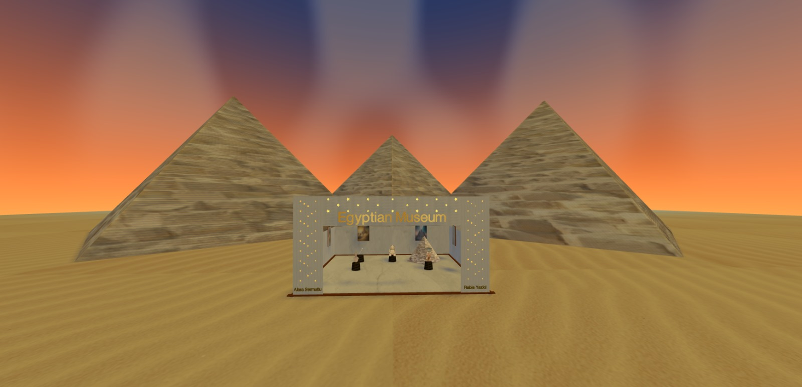

# Egyptian Museum Virtual Experience

A virtual 3D museum experience built with Three.js, showcasing Egyptian artifacts and interactive elements.

## 📸 Preview

<div align="center">
  
</div>

## Project Structure

### JavaScript Files

#### Core
```
js/core/
└── Scene.js                    # Main scene setup and management
```

#### Environment
```
js/environment/
├── WallBuilder.js             # Handles museum wall construction
└── EnvironmentBuilder.js      # Overall environment setup
```

#### Objects
```
js/objects/
├── PedestalManager.js         # Manages artifact pedestals
└── ArtifactLoader.js         # Handles loading of 3D artifacts
```

#### Shaders
```
js/shaders/
└── ShaderManager.js          # Custom shader management
```

#### Entry Point
```
js/
└── main.js                   # Application entry point
```

### Assets
```
assets/
├── characters/
│   ├── dagger/
│   │   └── dagger_texture.jpg
│   ├── nefertiti/
│   │   └── texture.png
│   ├── pyramid/
│   │   └── pyramidtexture.jpeg
│   ├── sphinx/
│   │   └── sphinx.jpg
│   └── vase/
│       ├── atv_texture.jpg
│       └── vase_texture.jpg
├── floor/
│   └── image.png
├── pedestal/
│   └── image.png
└── poster/
    ├── poster1.jpg
    ├── poster2.jpeg
    ├── poster3.jpeg
    └── poster4.jpeg
```

## File Descriptions

### Core Files
- **Scene.js**: Manages the main Three.js scene, including camera setup, lighting, and render loop.

### Environment Files
- **WallBuilder.js**: Creates and textures museum walls, including decorative elements and lighting effects.
- **EnvironmentBuilder.js**: Coordinates overall environment construction, including walls, floors, and ambient elements.

### Object Management
- **PedestalManager.js**: Handles the creation and placement of artifact display pedestals.
- **ArtifactLoader.js**: Manages the loading and positioning of 3D artifact models.

### Shader System
- **ShaderManager.js**: Contains custom shader implementations for special visual effects.

## Dependencies
- Three.js
- WebGL support
- Modern JavaScript (ES6+)
